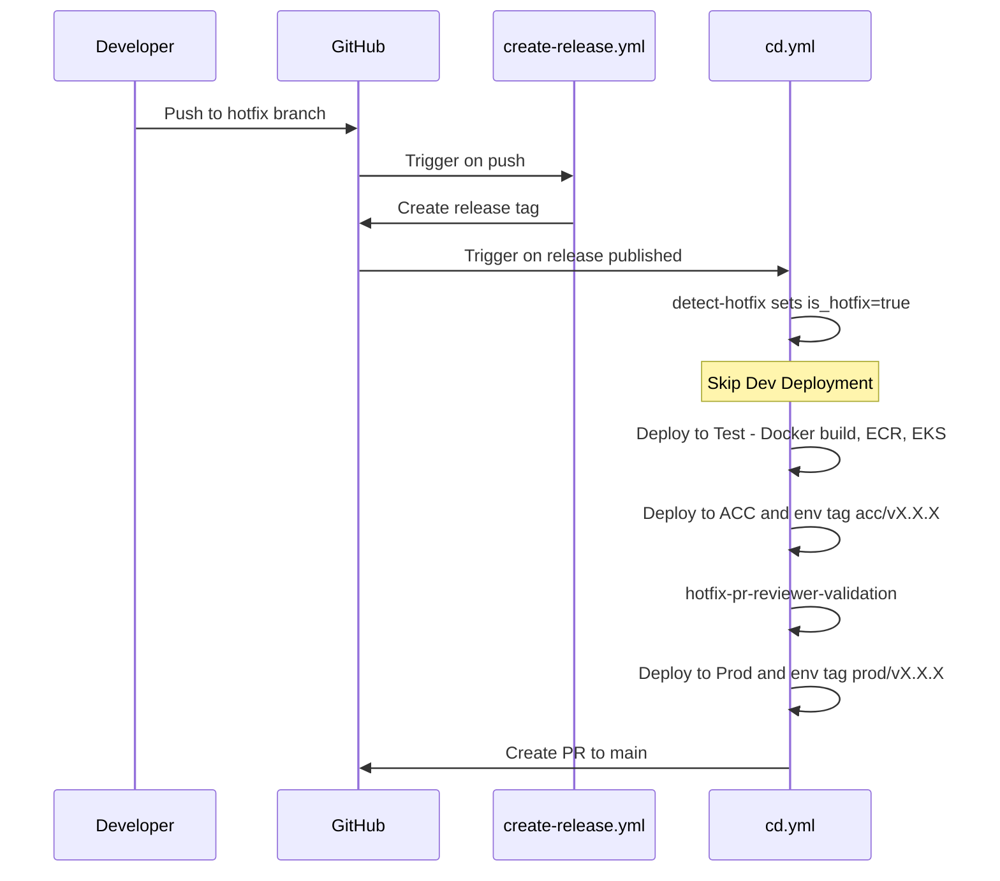
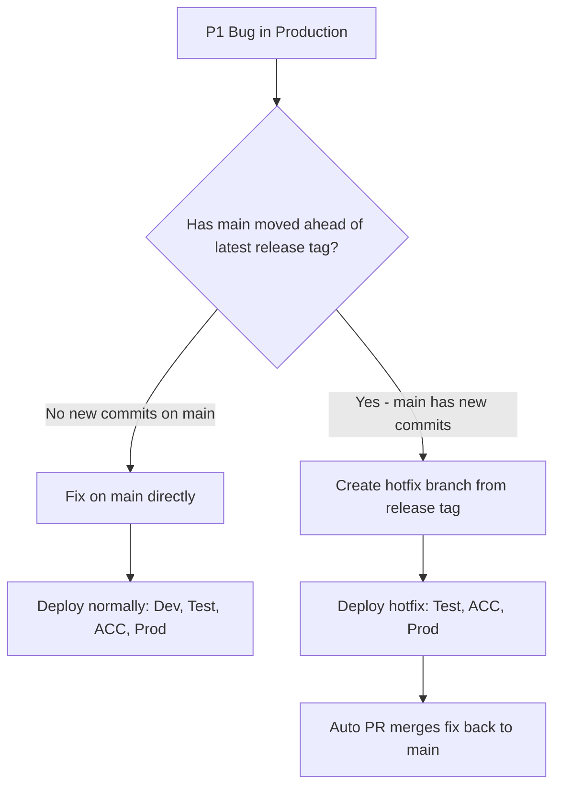

# Hotfix Deployment Strategy — Usage Guide (GitHub Actions / React EKS)

## 1. Overview

This guide explains **how to use the hotfix deployment strategy** for React (Vite + TypeScript) projects deployed via GitHub Actions CI/CD pipelines to AWS EKS. It covers the end-to-end process of creating a hotfix branch, deploying the fix, and merging it back to `main`.

> **Prerequisites:** Your repo must already have hotfix support enabled in its GitHub Actions workflows. If not, see the **[HOTFIX_MIGRATION_GUIDE_REACT.md](HOTFIX_MIGRATION_GUIDE_REACT.md)** for step-by-step instructions to add it.

The strategy enables rapid production fixes via `hotfix/*` branches that **skip Dev** and deploy directly through **Test → ACC → Prod**, followed by an **auto-created PR** to merge the fix back into `main`.

### Deployment Flow Comparison

```
Normal (main → release tag):     Dev → Test → ACC → Prod
Hotfix (hotfix/* → release tag): [Skip Dev] → Test → ACC → Prod → Auto PR to main
```

### How It Works (GitHub Actions)

The React EKS template uses a **release-triggered CD** pipeline — the same architecture as the Apigee template:

| Workflow | Trigger | Purpose |
|----------|---------|---------|
| `create-release.yml` | Push to `main` or `hotfix/*` | Auto-creates a release tag (e.g., `v1.2.0`) |
| `cd.yml` | Release published | CD pipeline — routes the tag through the correct environments (inline deploy steps) |
| `ci.yml` | Pull request to `main` | CI checks only (ESLint, test coverage) — not part of the deployment chain |
| `hotfix.yml` | Manual (`workflow_dispatch`) | Utility — creates a `hotfix/*` branch from the latest release tag |



### Key Architecture Note

The React template uses a `release: published` trigger on `cd.yml` — the same as the Apigee template. This means branch context is lost (GitHub provides only the tag ref). Hotfix detection uses **tag ancestry** (`git branch -r --contains`) to determine if the release tag originated from a `hotfix/*` branch. Each environment has its own inline deployment steps (Docker build → ECR push → kubectl deploy) rather than calling a reusable workflow.

---

## 2. When to Use Hotfix Branch vs. Fix on Main

In most cases (~90%), when a prod bug is reported, `main` has **not moved** — no new commits have been pushed since the production deployment. In that case, there's no need for a hotfix branch. Simply fix on `main` and deploy through the normal pipeline.

The hotfix branch is only needed when `main` has moved ahead with new commits that are not yet production-ready.



**How to check if main has moved** — run the helper script from the repo root:

```powershell
.\scripts\check-hotfix-needed.ps1
```

The script fetches the latest tags, finds the current production tag (`prod/*`), compares it with `origin/main`, and prints a clear recommendation with next steps.

---

## 3. Step-by-Step Execution

### 3.1 One-Time Setup: Repository Secrets and Variables

> **Skip this step** if secrets and variables are already configured.

Go to **Settings → Secrets and variables → Actions** and verify the following exist:

**Repository Secrets:**

| Secret | Purpose |
|--------|---------|
| `IT_EADI_API_MGMT_GIT_TOKEN` | GitHub PAT with `repo` scope — for releases, tags, PRs, branch protection |
| `AWS_ACCESS_KEY_ID_NON_PROD` | AWS access key for Dev/Test (non-prod EKS cluster) |
| `AWS_SECRET_ACCESS_KEY_NON_PROD` | AWS secret key for Dev/Test (non-prod EKS cluster) |
| `AWS_ACCESS_KEY_ID_ACC` | AWS access key for ACC (acc EKS cluster) |
| `AWS_SECRET_ACCESS_KEY_ACC` | AWS secret key for ACC (acc EKS cluster) |
| `AWS_ACCESS_KEY_ID_PROD` | AWS access key for Prod (prod EKS cluster) |
| `AWS_SECRET_ACCESS_KEY_PROD` | AWS secret key for Prod (prod EKS cluster) |

**Repository Variables:**

| Variable | Purpose | Example |
|----------|---------|---------|
| `PR_REVIEWERS` | Comma-separated GitHub usernames for hotfix PR reviewers | `ops-lead-1,ops-lead-2` |

### 3.2 Create Hotfix Branch (via Hotfix Workflow)

1. Go to **Actions → "Create Hotfix Branch"** workflow
2. Click **Run workflow**
3. Select **Environment**: `prod` (default) or `acc`
4. Enter a **Hotfix name**: e.g., `fix-header-alignment` (spaces are auto-converted to hyphens)
5. Click **Run workflow**

The workflow will automatically:
- Find the latest release tag (`v*`)
- Create the `hotfix/<hotfix-name>` branch from that tag
- Push the branch to GitHub
- Apply branch protection (prevent accidental deletion)

### 3.3 Apply the Fix

```bash
git fetch origin
git checkout hotfix/<hotfix-name>
# Make your fix
git add .
git commit -m "fix: <describe the fix>"
git push origin hotfix/<hotfix-name>
```

### 3.4 Pipeline Execution

1. **`create-release.yml`** — auto-triggers on the push, creates a release tag
2. **`cd.yml`** — triggers on the release published event
3. **detect-hotfix** — identifies this is a hotfix release (`is_hotfix=true`)
4. **Dev** — skipped (hotfix condition)
5. **pre-deploy-safety-check** — skipped (only runs for main releases)
6. **Test** — runs (Docker build → ECR → EKS deploy)
7. **ACC** — runs after Test succeeds + tags `acc/vX.X.X`
8. **hotfix-pr-reviewer-validation** — validates `PR_REVIEWERS` before Prod
9. **Prod** — runs after ACC succeeds + reviewer validation passes + tags `prod/vX.X.X`
10. **hotfix-auto-pr** — auto-creates PR to merge `hotfix/*` → `main`

### 3.5 Merge Hotfix Back to Main

1. Review auto-created PR
2. Resolve merge conflicts (if any)
3. Merge PR
4. The merge triggers `create-release.yml` on `main` → creates a new release → normal pipeline deploys through Dev → Test → ACC → Prod

---

## 4. Ops Safety Net — Catching Missed Hotfix Decisions

### 4.1 Pipeline-Level Protection (Automatic)

Three automated safety checks run in the CD pipeline before deployment (for **main releases only**, not hotfix branches):

| Check | Stage | What It Does |
|-------|-------|-------------|
| **Pre-Deployment Safety Check** | Before Test | Scans for unmerged hotfix branches deployed to production |
| **Pre-Deployment Safety Check (ACC)** | Before ACC | Re-scans before ACC deployment |
| **Pre-Deployment Safety Check (PROD)** | Before Prod | Final scan before Prod deployment |

The safety check **fails the pipeline** (`exit 1`) if a hotfix was deployed to production but not yet merged back to main.

**What ops should look for in the safety check output:**

| Scenario | What Logs Show | Action |
|----------|---------------|--------|
| No active hotfixes | `No active hotfix branches found. ✅ Safe to deploy.` | ✅ Approve |
| Hotfix merged to main | `Merged to main: Yes ✅` | ✅ Approve |
| Hotfix NOT in production | `Prod tag: No ✅ (not deployed to production)` | ✅ Approve |
| Hotfix in production, NOT merged | `Prod tag: Yes (...) 🚨 BLOCKER` | ❌ **Do not override** — merge the hotfix PR first |
| Safety check fails | `🚨 DEPLOYMENT BLOCKED` error | ❌ **Do not override** — merge the hotfix PR first |

---

> **Need to add hotfix support to your existing React EKS repo?** See the **[HOTFIX_MIGRATION_GUIDE_REACT.md](HOTFIX_MIGRATION_GUIDE_REACT.md)** for the complete implementation checklist.
