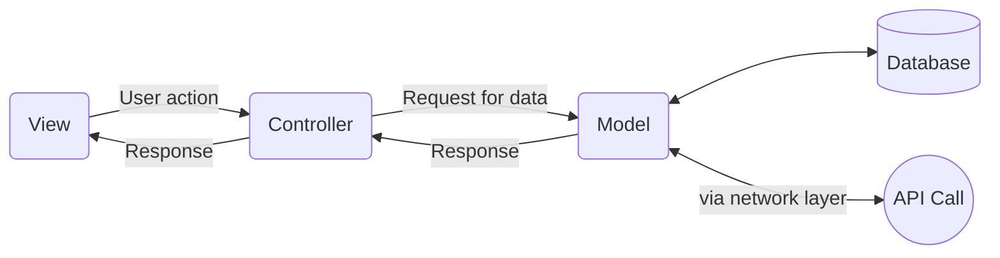

# Project Setup
1. Clone the project and open it in VS Code.
2. A popup will appear in the VS Code if you don't have the recommended extensions installed. Then, just click on the "Install" button and it will install all of the recommended extensions.  
  
  
3. Install dependencies (make sure you are on Philips network and have Node v20 or higher)
```bash
  npm install
```
4. Start the server (this will start the app at http://localhost:3000/)
```bash
  npm run dev
```

# Application Architecture
This project is based on Model-View-Controller(MVC) architecture.
1. View (`src/screens`) - This layer holds all of the UI logic(jsx) and communicates with the "controller" for any user action or data requirement. Use [Filament](https://filament-storybook.eu1.phsdp.com/main/?path=/docs/intro--docs) to create the UI as this is the library created and maintained by Philips.
2. Controller (`src/controllers`) - This layer responds to requests from "view" layer and perform the required action which can be - input validation or getting data from "model". It acts as a communication channel between "view" and "model".
3. Model (`src/models`) - This layer manages the data for the application and takes care of getting the data via API call/database. It receives request from "controller", gets the data from network or database, convert the response into a class instance("entity") and give it to "controller".
4. Entity (`src/entities`) - The data from API response or database is converted into an instance of a class, there are multiple reasons behind it.
    - Provides type-safety. Entities define the data types for every field, so rest of the code can consume the response safely.
    - Provides way to only extract the fields from the API response that is needed in the application.
    - Provides flexibility to add custom fields in the response.



## Network Layer
The "model" layer make use of network layer (`src/utils/apiClient`) to make API calls instead of using the `axios` directly. This helps in maintaining several API related configurations in a single file and enables below features -
  - Easy to configure API base urls for different environments - dev, test, acc and prod.
  - Enables a central place to inject access token into every API call.
  - Enables to track or log every network request.
  - Enables easy migration from `axios` to another library, if needed.

> **Note:** While doing the API integration, don't forget to update `API_BASE_URL` in `src/utils/appConfig` file. 

# Single Sign-On
To enable SSO, first register your app in Azure. You can follow this [doc](https://dev.azure.com/PhilipsAgile/55.0%20Enterprise%20Architecture/_wiki/wikis/55.0-Enterprise-Architecture.wiki/19919/User-Role-Management) for more details. Once you have all of the details handy, open `src/utils/appConfig` file and set `ENABLE_SSO` to `true` and update `MSAL_CLIENT_ID`, `MSAL_SCOPE` and `MSAL_REDIRECT_URI` accordingly.

# Testing
[Vitest](https://vitest.dev/) is our choice of testing framework. You can check [Why Vitest?](https://vitest.dev/guide/why.html) and [Comparisons with Other Test Runners](https://vitest.dev/guide/comparisons.html) for more details.

To run test cases, do
```bash
  npm run test
```

To generate the code coverage report, do
```bash
  npm run coverage
```
The `tests` folder contains all of the test cases and should be used to add new test cases.

# Deployment in EKS
Reach out to support team first to get your ECR repository created for your project. The ECR repository is the place to store Docker images. Once it's done, update the `cd.yml` and `package.json` files accordingly,
1. Open `.github/workflows/cd.yml`, update the value of `GITHUB_REPOSITORY_NAME` variable with your repository name, e.g, itaap-react-demo-ui
2. Enter value for `ECR_REPOSITORY_PATH` variable. This will be provided by support team and will look something like this - itaap/demo/itaap-react-demo-ui
3. Enter value for `EKS_NAMESPACE` for dev, test, acc and prod jobs. This will look something like this - itaap-non-prod-demo-dev
4. Enter value for `EKS_APPLICATION_PATH_DEV_ACC_PROD` and `EKS_APPLICATION_PATH_TEST`. The application URL depends on the path you specify for this variable. Let's say you provide `/ui/demo` value for this variable and the host name is `dev.apps.api.it.philips.com` then your application URL would be `https://dev.apps.api.it.philips.com/ui/demo`
5. Open `package.json` file and update the `/eks/application/path` placeholder with the values you specified in the step 4.
